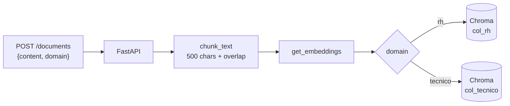
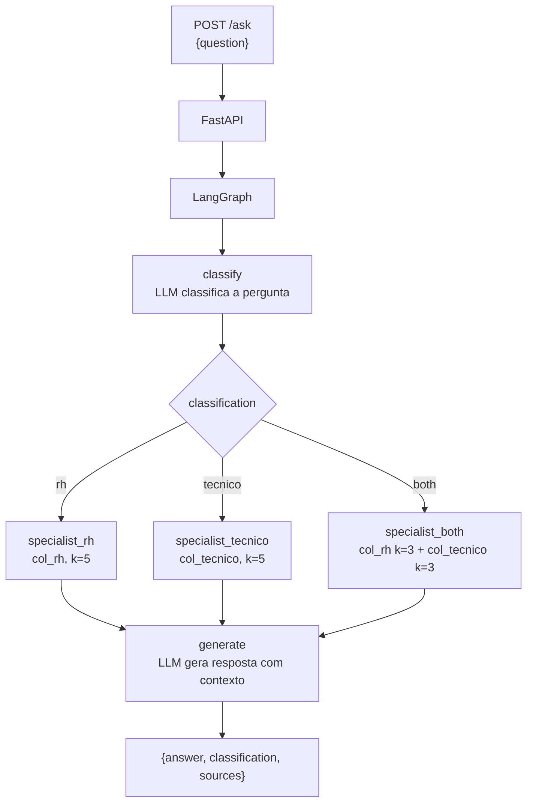
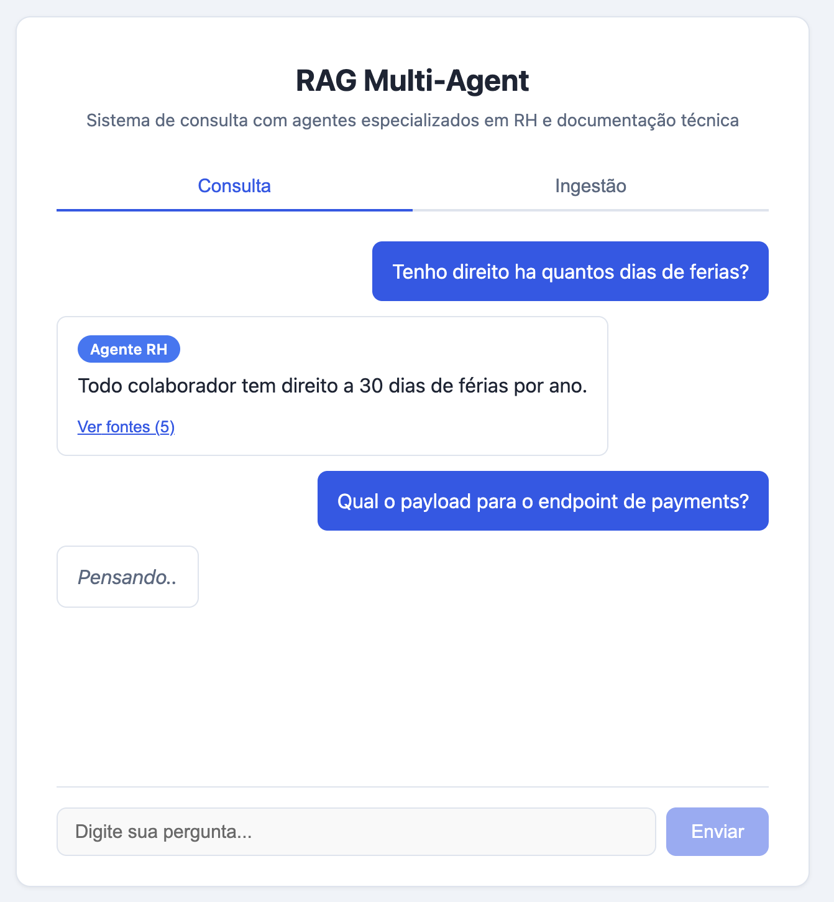

# RAG Multi-Agente API

API para ingestão de documentos e consultas com RAG multi-agente. Orquestra agentes especialistas por domínio (RH e técnico) via LangGraph, com vector DB (Chroma) e suporte a **OpenAI**, **AWS Bedrock** e **Google Gemini**.

---

## Arquitetura

### Ingestão de Documentos



### Consulta RAG Multi-Agente



---

## Setup e Execução

### Pré-requisitos

- Docker e Docker Compose
- Credenciais de um dos providers: **OpenAI**, **AWS Bedrock** ou **Google Gemini**

### Configuração

1. Copie o arquivo de variáveis de ambiente:

```bash
cp .env.example .env
```

2. Configure o provider escolhido no `.env`:

**OpenAI:**
```
LLM_PROVIDER=openai
OPENAI_API_KEY=sk-proj-sua-chave-aqui
```

**AWS Bedrock:**
```
LLM_PROVIDER=bedrock
AWS_REGION=us-east-1
AWS_ACCESS_KEY_ID=sua-access-key
AWS_SECRET_ACCESS_KEY=sua-secret-key
```

**Google Gemini:**
```
LLM_PROVIDER=gemini
GOOGLE_API_KEY=sua-chave-aqui
```

> Ao trocar de provider execute `docker compose down -v`. Embeddings de providers diferentes têm dimensões incompatíveis.

### Execução com Docker Compose

```bash
docker compose up -d
```

| Serviço | URL |
|---------|-----|
| API | http://localhost:8000 |
| Swagger | http://localhost:8000/docs |
| Frontend | http://localhost:3000 |

### Populando com dados de exemplo

```bash
python scripts/migration.py
```

Insere 5 documentos em cada domínio (RH e técnico) via `POST /documents`. Requer a API rodando.

### Execução local (sem Docker)

```bash
pip install -r requirements.txt
```

Inicie o ChromaDB separadamente (ou aponte `CHROMA_HOST`/`CHROMA_PORT` para uma instância existente) e rode:

```bash
uvicorn src.main:app --host 0.0.0.0 --port 8000
```

> Para execução local, configure `CHROMA_HOST=localhost` e `CHROMA_PORT=8000` (ou a porta do seu Chroma) no `.env`.

---

## Exemplos de Uso

### Ingestão — POST /documents

**Documento RH:**

```bash
curl -X POST http://localhost:8000/documents \
  -H "Content-Type: application/json" \
  -d '{
    "content": "A empresa concede 30 dias corridos de férias após 12 meses de trabalho. O colaborador deve solicitar com 30 dias de antecedência ao gestor direto.",
    "domain": "rh"
  }'
```

```json
{
  "doc_id": "f47ac10b-58cc-4372-a567-0e02b2c3d479",
  "chunks_count": 1,
  "domain": "rh"
}
```

**Documento técnico:**

```bash
curl -X POST http://localhost:8000/documents \
  -H "Content-Type: application/json" \
  -d '{
    "content": "A API de pagamentos aceita requisições POST no endpoint /v1/payments. O payload deve incluir amount, currency e customer_id. A autenticação é feita via Bearer token no header Authorization.",
    "domain": "tecnico"
  }'
```

O campo `domain` aceita `"rh"` ou `"tecnico"`. Valores inválidos retornam HTTP 422. Conteúdo vazio (`""`) retorna 422 (validação Pydantic) e conteúdo apenas com espaços (`"   "`) retorna 400.

### Consulta — POST /ask

**Pergunta de RH** — rota para `specialist_rh`:

```bash
curl -X POST http://localhost:8000/ask \
  -H "Content-Type: application/json" \
  -d '{"question": "Qual é a política de férias?"}'
```

```json
{
  "answer": "A empresa concede 30 dias corridos de férias após 12 meses de trabalho...",
  "classification": "rh",
  "sources": [
    {
      "document": "A empresa concede 30 dias corridos...",
      "metadata": {"doc_id": "f47ac10b-..."}
    }
  ]
}
```

**Pergunta técnica** — rota para `specialist_tecnico`:

```bash
curl -X POST http://localhost:8000/ask \
  -H "Content-Type: application/json" \
  -d '{"question": "Como integrar a API de pagamentos?"}'
```

```json
{
  "answer": "A API de pagamentos aceita requisições POST no endpoint /v1/payments...",
  "classification": "tecnico",
  "sources": [...]
}
```

**Pergunta ambígua** — rota para `specialist_both` (busca em ambas as coleções):

```bash
curl -X POST http://localhost:8000/ask \
  -H "Content-Type: application/json" \
  -d '{"question": "Quais são as políticas internas de uso de sistemas?"}'
```

```json
{
  "answer": "...",
  "classification": "both",
  "sources": [...]
}
```

### Health check

```bash
curl http://localhost:8000/health
# {"status": "ok"}
```

---

## Variáveis de Ambiente

| Variável | Descrição | Obrigatório quando |
|----------|-----------|--------------------|
| `LLM_PROVIDER` | `openai`, `bedrock` ou `gemini` | sempre |
| `OPENAI_API_KEY` | Chave da API OpenAI | `LLM_PROVIDER=openai` |
| `AWS_REGION` | Região AWS (ex: us-east-1) | `LLM_PROVIDER=bedrock` |
| `AWS_ACCESS_KEY_ID` | Credencial AWS (lida pelo boto3, não via `config.py`) | `LLM_PROVIDER=bedrock` |
| `AWS_SECRET_ACCESS_KEY` | Credencial AWS (lida pelo boto3, não via `config.py`) | `LLM_PROVIDER=bedrock` |
| `GOOGLE_API_KEY` | Chave da API Google | `LLM_PROVIDER=gemini` |
| `CHROMA_HOST` | Host do Chroma | — (padrão: chroma) |
| `CHROMA_PORT` | Porta do Chroma | — (padrão: 8000) |

---

## Decisões de Design

### 1. LangChain + LangGraph

**LangChain** fornece abstrações para LLM, embeddings e retrieval. **LangGraph** orquestra o fluxo entre agentes via grafo de estados (state machine).

A combinação permite:
- Trocar de provider (OpenAI/Bedrock/Gemini) sem alterar lógica de agentes
- Adicionar novos agentes apenas adicionando um nó ao grafo
- Depurar cada etapa inspecionando o estado entre nós

### 2. Pipeline Unificado com LangChain

Tanto a **ingestão** (`POST /documents`) quanto a **consulta** (`POST /ask`) usam LangChain para embeddings e acesso ao ChromaDB. Isso garante compatibilidade de vetores e elimina duplicação de código entre os dois caminhos.

A ingestão usa `langchain_chroma.Chroma.add_texts()` para armazenar chunks, e a consulta usa `Chroma.as_retriever()` para buscar contexto.

### 3. Classificação via LLM com Structured Output

O orquestrador usa o LLM para classificar perguntas em `rh`, `tecnico` ou `both`. A saída é validada via `with_structured_output` do LangChain — o LLM retorna um objeto Pydantic tipado (`Literal["rh", "tecnico", "both"]`), eliminando parsing de texto livre e garantindo que a classificação é sempre um valor válido.

**Alternativas consideradas:**

| Abordagem | Prós | Contras |
|-----------|------|---------|
| **Keywords/regex** | Zero latência, zero custo | Frágil: não entende sinônimos, contexto ou perguntas ambíguas. Cada domínio novo exige manutenção manual de listas |
| **Embedding similarity** | Sem chamada de inferência, boa generalização semântica | Requer embeddings de referência por domínio e calibração de threshold de similaridade |
| **Classificador fine-tuned** (BERT, etc.) | Rápido, barato em runtime, alta acurácia | Requer dataset rotulado para treino e pipeline de ML separado |
| **LLM com structured output** (escolhido) | Entende contexto e ambiguidade, zero manutenção de regras, type-safe | Custo e latência de uma chamada extra ao LLM |

**Por que essa abordagem:** o projeto tem dois domínios com fronteira semântica difusa (ex: "políticas de uso de sistemas" cruza RH e técnico). Keywords não capturam essa nuance. Embedding similarity exigiria calibração manual. Um classificador fine-tuned exigiria dataset rotulado que não existe. O LLM resolve com zero setup adicional, e o `with_structured_output` garante type safety — se a resposta não for um dos três valores válidos, o Pydantic rejeita antes de chegar ao grafo.

Se a chamada ao LLM falhar por qualquer motivo (timeout, erro de parsing), o fallback é `"both"` — busca em ambas as coleções. Em cenários de alta escala ou latência crítica, a abordagem ideal seria migrar para um classificador leve fine-tuned nos dados reais de uso.

### 4. Estado Plano (Flat TypedDict)

O estado compartilhado entre nós do grafo é um `TypedDict` simples:

```python
class AgentState(TypedDict):
    question: str                                        # Pergunta original
    classification: Literal["rh", "tecnico", "both"]    # Saída do classificador
    context: str                                         # Texto recuperado do Chroma
    sources: list[dict]                                  # Chunks com metadata
    answer: str                                          # Resposta final
```

Cada nó lê o que precisa e escreve apenas os campos que produz. O LangGraph faz merge automático. Sem estados aninhados — complexidade desnecessária para dois especialistas.

### 5. specialist_both como Nó Único com Contexto Rotulado

O `specialist_both` é um nó único que chama ambos os retrievers internamente e rotula o contexto combinado antes de passar ao gerador:

```
[Contexto RH]
<chunks da coleção rh>

[Contexto Técnico]
<chunks da coleção tecnico>
```

Os rótulos ajudam o LLM a entender a origem de cada trecho durante a geração da resposta.

**Alternativas consideradas:**

| Abordagem | Prós | Contras |
|-----------|------|---------|
| **Fan-out paralelo com `Send`** (ideal) | Busca nas duas coleções em paralelo, menor latência, cada especialista roda de forma independente | Exige `reducer` functions no `AgentState` para merge dos resultados, adição de nós intermediários e lógica de join — complexidade estrutural significativa no grafo |
| **Nó único sequencial** (escolhido) | Simples, sem alteração no schema do estado, sem reducers, fácil de depurar | As duas buscas ao Chroma são sequenciais — latência aditiva (não paralela) |

**Por que essa abordagem:** as buscas ao Chroma são chamadas HTTP locais com latência na ordem de milissegundos. Para dois especialistas, a diferença entre sequencial e paralelo é irrelevante em volume baixo/médio. O fan-out paralelo seria o design correto em produção com muitos domínios ou retrievers lentos — o padrão `Send` do LangGraph resolve esse cenário sem alterar a lógica de cada especialista, apenas adicionando nós de dispatch e merge.

### 6. Validação em Duas Camadas

A validação acontece em duas etapas: **Pydantic** (schema) e **handler** (lógica de negócio).

- `domain` usa `Literal["rh", "tecnico"]` — domínios inválidos são rejeitados com HTTP 422 antes de qualquer lógica
- `content` e `question` usam `min_length=1` — strings vazias (`""`) retornam 422
- Strings apenas com espaços (`"   "`) passam pelo Pydantic mas são rejeitadas no handler com HTTP 400

O Swagger documenta automaticamente os valores permitidos e os códigos de erro.

### 7. Configuração Centralizada (Pydantic BaseSettings)

Todas as variáveis de ambiente são centralizadas em `core/config.py` via `pydantic-settings`. Isso elimina `os.environ.get()` espalhado pelo código e fornece validação de tipos, valores default e carregamento automático de `.env`.

### 8. Prompts em YAML

Os prompts dos agentes (classificação e geração de resposta) são definidos em arquivos YAML em `agents/prompts/`. Um loader converte YAML para `ChatPromptTemplate` do LangChain. Isso permite editar prompts sem alterar código Python e facilita review por pessoas não-técnicas.

### 9. Dependency Injection via FastAPI

O grafo LangGraph é compilado uma única vez no lifespan do FastAPI e armazenado em `app.state.graph`. As rotas recebem o grafo via `Depends(get_graph)`, eliminando o uso de variáveis globais e facilitando testes com mocks.

### 10. Fallback do Generator para Contexto Vazio

O nó `generate` verifica explicitamente se o contexto recuperado é vazio antes de chamar o LLM:

```python
if not state.get("context", "").strip():
    return {"answer": "Não encontrei documentos relevantes para responder à sua pergunta."}
```

Isso evita uma chamada desnecessária ao LLM e retorna uma mensagem clara ao usuário quando nenhum chunk relevante é encontrado no Chroma.

---

## Fluxo de Roteamento

1. Usuário envia `POST /ask {"question": "Qual é a política de férias?"}`
2. FastAPI valida o request e chama `handle_ask(question, graph)`
3. O grafo LangGraph inicia com o estado `{question: "..."}`
4. **Nó CLASSIFY**: O LLM recebe a pergunta e retorna a classificação (`"rh"`)
5. **Roteamento condicional**: Com base na classificação, o grafo direciona para o nó especialista correspondente
6. **Nó SPECIALIST_RH**: O retriever LangChain busca os 5 chunks mais similares na coleção `rh` do Chroma
7. **Nó GENERATE**: O LLM recebe o contexto recuperado + a pergunta original e gera a resposta
8. O resultado final (`answer` + `classification` + `sources`) é retornado ao usuário

Para perguntas técnicas, o fluxo é idêntico mas roteia para `specialist_tecnico`. Para perguntas ambíguas, roteia para `specialist_both` que busca em ambas as coleções com k=3 cada.

---

## Testes

### Via Docker (sem instalação local)

Não requer pip. O Dockerfile usa **multi-stage build** com dois stages independentes — `test` e `production`. LLM e Chroma são mockados — nenhum serviço externo precisa estar rodando.

```bash
docker compose --profile test run --rm --build test
```

### Localmente

```bash
pip install -r requirements.txt

# Suite completa
pytest tests/

# Com relatório de cobertura
pytest tests/ --cov=src --cov-report=term-missing

# Apenas unitários
pytest tests/unit/

# Apenas integração
pytest tests/integration/
```
---

## Bonus: Frontend

Interface web em React + Vite com duas abas — **Consulta** e **Ingestão**. Mostra a classificação do agente (RH, Técnico ou Ambos) e as fontes usadas na resposta.



Acessível em http://localhost:3000 após `docker compose up -d`.

---

## O que ficou de fora (possíveis melhorias)

### Autenticação nos endpoints

`POST /documents` e `POST /ask` são públicos. Adicionar autenticação (API key via header ou OAuth2) seria um middleware ou `Depends` na camada de rotas, sem impacto na lógica dos agentes.

### Histórico de conversas

Cada request é stateless — o grafo recebe apenas a pergunta atual. Suporte a multi-turn exigiria persistir o histórico (ex: Redis ou banco relacional) e injetar as mensagens anteriores no prompt de geração.

### Domínios dinâmicos

As coleções `rh` e `tecnico` são fixas em `collection_map` no `config.py`. Adicionar um novo domínio (ex: `financeiro`) exige alterar a configuração e fazer deploy. Uma abordagem dinâmica armazenaria os domínios disponíveis no próprio Chroma ou em banco e os carregaria em runtime, com o classificador recebendo a lista via prompt.

### Observabilidade e gerenciamento de prompts (LangSmith)

Atualmente os prompts são arquivos YAML locais e não há tracing das execuções do grafo. Em um cenário de produção com múltiplos agentes, **LangSmith** resolveria dois problemas:

- **Observabilidade**: tracing end-to-end de cada execução do LangGraph — tempo por nó, tokens consumidos, inputs/outputs de cada etapa, latência do retriever vs LLM. Isso permite identificar gargalos (ex: classificação lenta, retrieval retornando chunks irrelevantes) sem adicionar logging manual em cada nó.

- **Gerenciamento de prompts**: versionamento centralizado de prompts com histórico de alterações, testes A/B entre versões e rollback. Evita que mudanças em `classification.yaml` ou `answer.yaml` exijam deploy — o prompt é atualizado no LangSmith Hub e consumido em runtime via `langchain.hub.pull()`.

A integração é mínima: configurar `LANGCHAIN_TRACING_V2=true` e `LANGCHAIN_API_KEY` como variáveis de ambiente. O tracing é automático para chains e grafos LangChain/LangGraph, sem alteração de código.
